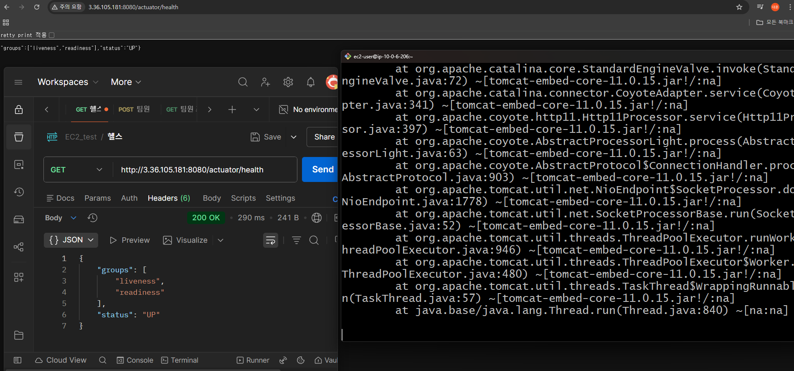
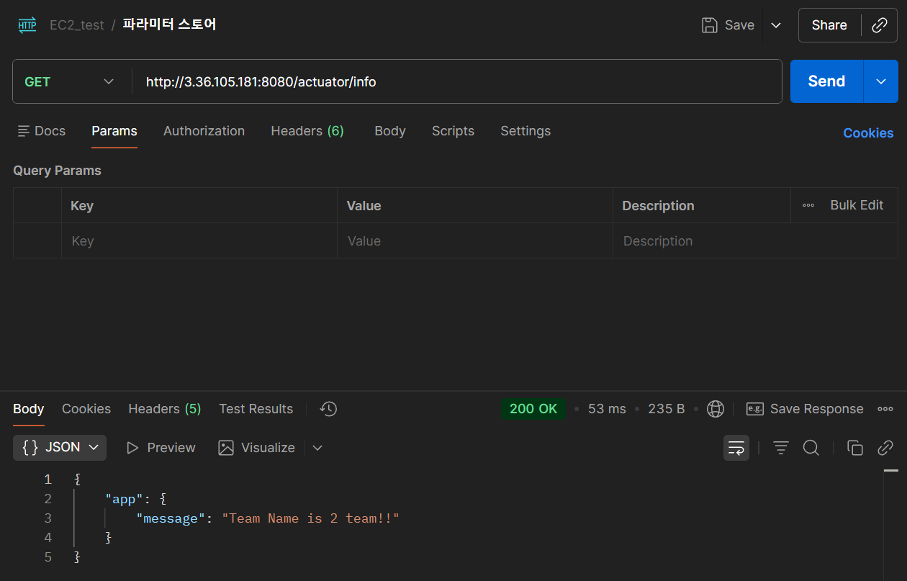
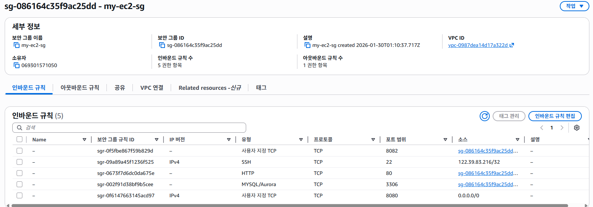
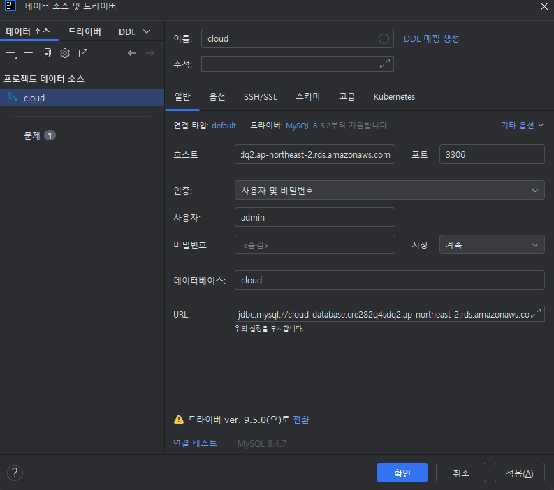
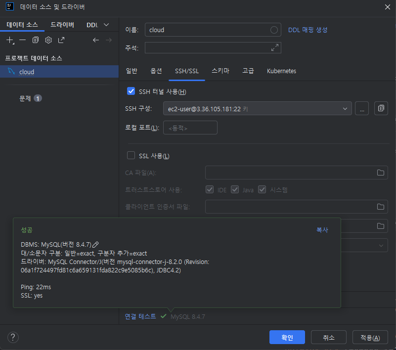

# cloud-architecture
클라우드 아키텍쳐 과제 레포지토리

## Lv_0.  AWS Budget 설정

## Lv_1. VPC, EC2
- VPC

- EC2

- 퍼블릭 ID 주소
3.36.105.181

- 배포 및 검증

## Lv_2 RDS
- Parameter store

  
- 인바운드 규칙

- 로컬 연결 테스트

3306 포트의 보안 그룹이 SG->SG로 설정 되어 있기 때문에 EC2를 통해서 접근 함.

